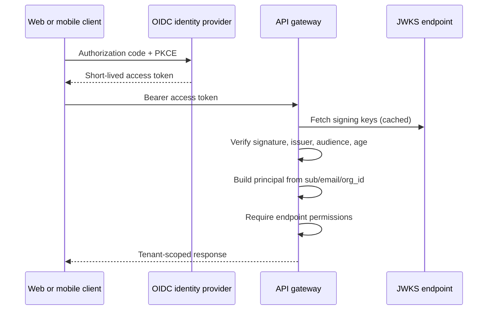
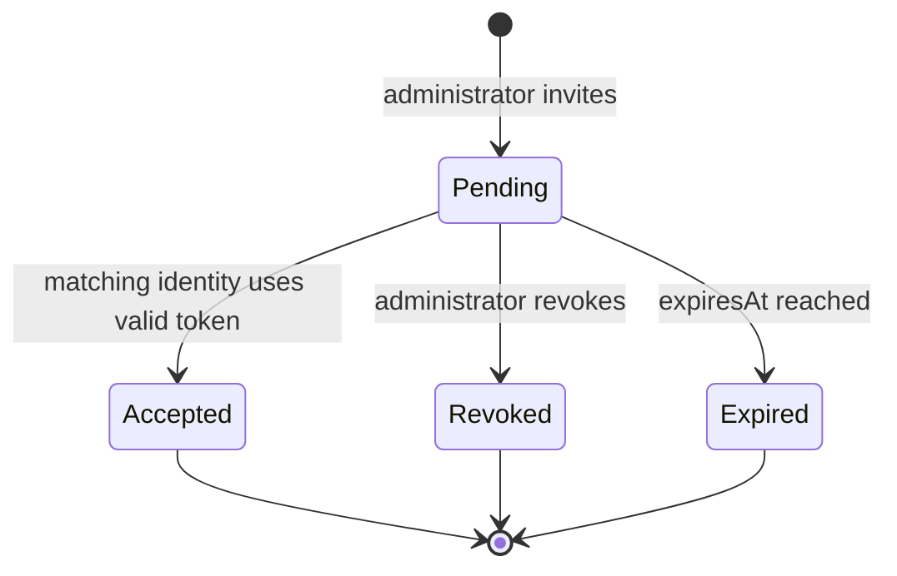

# Phase 4: Identity and organization slice

## Scope delivered

This slice establishes the security boundary required before persistent commerce
workflows are exposed:

- remote-JWKS verification of short-lived OIDC JWTs;
- issuer, audience, algorithm, age, and required-claim validation;
- centrally declared and enforced permissions;
- organization context derived only from verified `org_id`;
- organization membership invitation and acceptance;
- single-use SHA-256 invitation token storage;
- invitation expiry, email binding, role validation, and duplicate prevention;
- tenant-filtered membership reads;
- audit records for invitation and membership state changes;
- PostgreSQL users, roles, permissions, memberships, invitations, audit log,
  indexes, constraints, and RLS policies.

The API returns no invitation secret. The controller hands it to a notification
adapter boundary and returns only a queued-delivery status. The current
in-process implementation makes domain behavior independently testable; the
schema is the contract for the next PostgreSQL repository slice.

## Authentication flow

JWKS caching prevents an identity-provider call per request. Unknown key IDs
trigger controlled refresh. Failure to retrieve keys fails closed. Production
allows only asymmetric `RS256` or `ES256` signatures and never accepts unsigned
or symmetric tokens from public clients.

## Invitation state machine

Acceptance and membership creation must execute in one PostgreSQL transaction
using a row lock on the invitation. That prevents two concurrent requests from
consuming the same token. A corresponding outbox event is written in the same
transaction. Raw tokens are delivered once and never logged or stored.

## Permission model

Permissions are stable action strings, for example:

- `organization.member:read`
- `organization.member:invite`
- `organization.member:suspend`
- `organization.role:manage`
- `order:create`
- `pricing:read`

Roles are collections of permissions. System roles provide safe defaults;
tenant-created roles allow delegation. ABAC policy evaluation further narrows a
permission by branch, department, cost center, resource ownership, purchase
amount, and actor conditions. A permission never broadens tenant scope.

## Remaining Phase 4 work

The next slice replaces in-process repositories with transaction-scoped
PostgreSQL implementations, integrates the selected identity provider, emits
outbox events to Kafka, adds invitation delivery through SES, implements custom
role administration, session/device management, MFA policy endpoints, and
Playwright organization-administration journeys.
