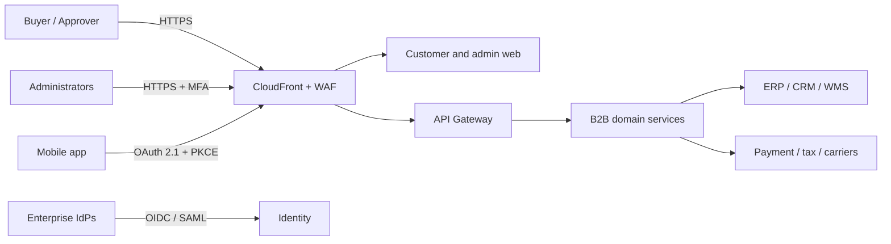
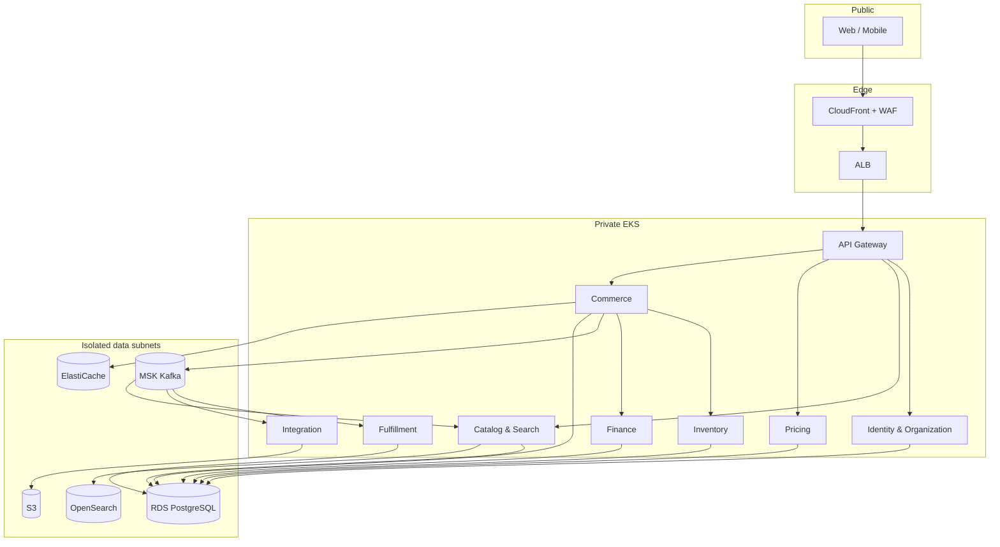
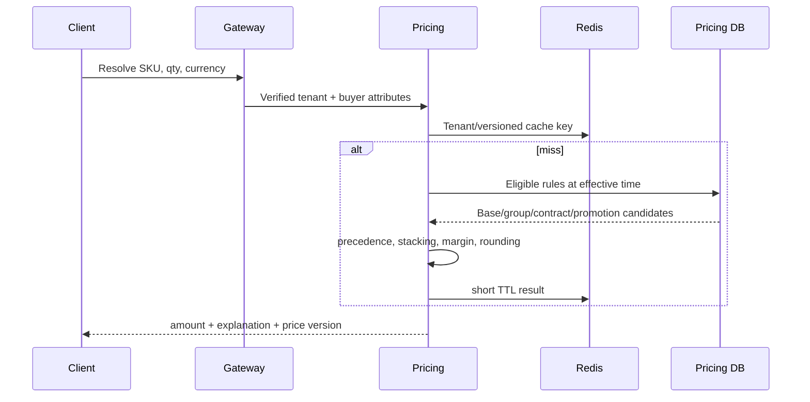
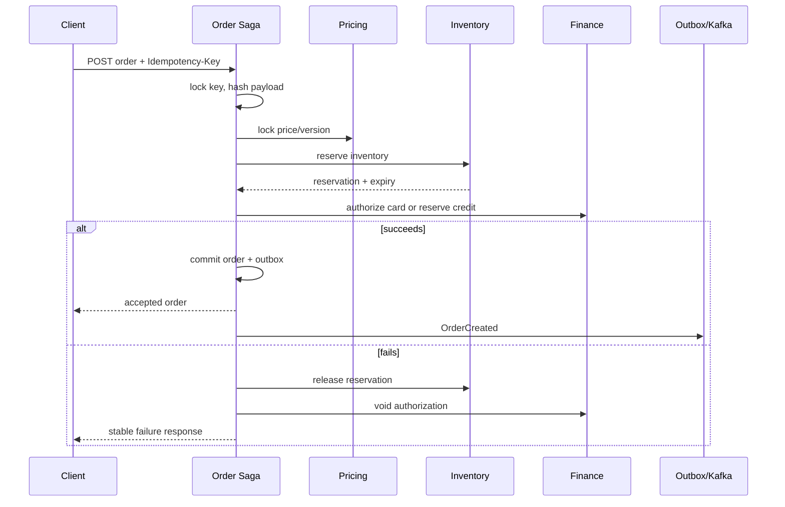
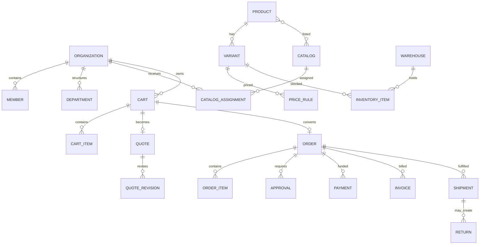

# Revision history

| Version | Date       | State    | Summary                                             |
| ------- | ---------- | -------- | --------------------------------------------------- |
| 0.1     | 2026-07-26 | Proposed | Foundation architecture and runnable vertical slice |

# Assumptions

The first market is English-language North America, prices are stored in integer
minor units, business timestamps are UTC, tax and payment computation are
delegated to PCI-appropriate providers, and a single order uses one settlement
currency. Organizations are the primary tenants. The platform starts in one AWS
region and three availability zones, with tested cross-region restore before
active/passive regional failover.

The implementation deliberately begins with coarse domain services. Identity,
organization, catalog/search, pricing, inventory, commerce (cart/quote/order),
finance, fulfillment, integration, notification, audit/reporting are deployable
boundaries. Category remains inside catalog; warehouse inside inventory; returns
inside fulfillment; credit and invoice inside finance. Traffic, team ownership,
or divergent scaling may justify later extraction.

# Executive summary

Meridian is an organization-scoped commerce platform for negotiated catalogs,
quotes, approvals, purchase orders, credit terms, and split fulfillment. It uses
a TypeScript monorepo, Next.js clients, NestJS services, PostgreSQL as the system
of record, Redis for ephemeral coordination, OpenSearch for discovery, and Kafka
for durable integration events. REST is the default boundary; asynchronous
events decouple workflows whose consistency can safely lag.

This is not a distributed CRUD system. Each service owns behavior and data.
Order creation is a persisted saga. Database transactions protect local
invariants and write an outbox record atomically. Consumers are idempotent.
Tenant identity comes only from verified credentials and is applied again as
PostgreSQL row-level security.

# Functional scope and roles

| Persona              | Principal capabilities                                       |
| -------------------- | ------------------------------------------------------------ |
| Buyer                | Browse assigned catalog, request quotes, create carts/orders |
| Approver             | Review spend/product policies, delegate, approve/reject      |
| Finance              | Credit accounts, invoices, allocations, statements, disputes |
| Procurement          | Templates, bulk upload, supplier and cost-center workflows   |
| Sales representative | Assisted ordering and negotiated quotes                      |
| Warehouse operator   | Allocate, pick, pack, ship, adjust inventory                 |
| Organization admin   | Members, roles, branches, addresses, limits                  |
| Platform operations  | Tenant support, integrations, health, audit                  |

Permissions are actions such as `order:create` or `price:override`, scoped by
organization and optionally branch, department, cost center, or resource. UI
navigation reflects permissions but every API action performs authoritative
RBAC plus ABAC evaluation.

# Non-functional requirements

| Measure                     |              Initial target |  Mature target |
| --------------------------- | --------------------------: | -------------: |
| Public API availability     |                       99.9% |         99.95% |
| Checkout/order availability |                      99.95% |         99.99% |
| Read API p95                |                      300 ms |         200 ms |
| Search p95                  |                      500 ms |         300 ms |
| Accepted order receipt p95  |                         1 s |         750 ms |
| Order confirmation p95      |                        10 s |            5 s |
| Event lag p95               |                         5 s |            2 s |
| Error rate                  |                       <0.5% |          <0.1% |
| Regional RPO / RTO          |                15 min / 4 h | 5 min / 60 min |
| Audit retention             |       7 years, configurable |           same |
| Application logs            | 30 days hot, 1 year archive |           same |

Capacity planning starts at 5,000 concurrent users, 2,000 read requests/second,
300 write requests/second, 5 million variants, and 100 million price rows.
Load tests provide the evidence to revise these assumptions.

# Recommended architecture

## System context

The edge terminates public traffic and blocks common abuse. The gateway validates
tokens, applies quotas, and routes allow-listed public APIs. Domain services sit
in private subnets. External failures are isolated behind integration adapters,
circuit breakers, bounded retries, and dead-letter queues. Edge, gateway, and
service spans share a correlation ID.

## Containers and trust boundaries

Security groups and Kubernetes NetworkPolicies allow only declared edges.
Services use workload identity and mTLS. Each service has a distinct database
role and schema initially; high-scale domains migrate to independent RDS
clusters without changing contracts.

## Service ownership

| Boundary              | Owns                                       | Synchronous dependencies | Events               |
| --------------------- | ------------------------------------------ | ------------------------ | -------------------- |
| Identity/Organization | users, memberships, policies, accounts     | IdP                      | OrganizationVerified |
| Catalog/Search        | products, categories, catalog assignments  | Pricing summary          | ProductPublished     |
| Pricing               | price lists, contracts, promotions         | Organization attributes  | PriceUpdated         |
| Inventory             | stock, reservations, warehouses            | none                     | InventoryReserved    |
| Commerce              | carts, quotes, approvals, orders, saga     | pricing, inventory       | OrderCreated         |
| Finance               | credit, payments, invoices, refunds        | PSP/tax adapter          | PaymentCaptured      |
| Fulfillment           | allocation, shipments, returns             | carriers                 | ShipmentCreated      |
| Integration           | connectors, mappings, imports/webhooks     | external systems         | IntegrationFailed    |
| Notification          | templates, preferences, delivery           | SES/SNS                  | NotificationSent     |
| Audit/Reporting       | immutable audit and analytical read models | none                     | consumes all         |

Synchronous calls are reserved for decisions required before responding:
authorization, final price, credit eligibility, and reservation attempts. Kafka
propagates facts and builds read models. gRPC is an optimization only after
profiling proves serialization/latency material.

# Core workflows

## Customer-specific price resolution

Contract beats buyer-group, promotion, then base by default. Within a source,
priority, quantity break, effective date, and deterministic rule ID resolve
ties. Decimal calculations occur at higher internal precision and round once
using the currency’s configured ISO minor units and half-even policy. Cache keys
include tenant, SKU, quantity bucket, currency, segment, and price-list version;
`PriceUpdated` increments versions, avoiding unsafe wildcard deletion.

## Order creation saga

Saga state and idempotency response are persisted. Each command carries an
operation ID; consumers store processed IDs in the same transaction as their
effects. Reservations use conditional atomic updates:
`available >= requested`, then increment reserved. Expiry is a durable delayed
command. Compensation is retried independently and alerts when its age exceeds
the SLO. Backpressure returns 429/503 with `Retry-After` before dependencies
collapse.

# Domain and data model

ULIDs are preferred externally for sortable opaque IDs; PostgreSQL UUIDv7 is
acceptable where supported. Sequential numbers exist only as tenant-scoped
human order/invoice references. Money is a signed `bigint` minor-unit amount
plus currency. JSONB holds sparse product attributes or provider payloads, never
core relational invariants. High-growth orders, audit, and outbox tables are
monthly range-partitioned when observed size warrants it.

Shared database/shared schema is rejected because ownership and blast radius are
poor. The initial compromise is one RDS cluster, schema and role per service,
with organization tenant IDs and RLS. Large or regulated tenants can be routed
to dedicated clusters through a tenant placement registry. Transactions call
`SET LOCAL app.tenant_id = ...`; the API never accepts tenant identity as
authority.

# API and event standards

Public REST uses `/api/v1`, nouns, cursor pagination, explicit sortable fields,
RFC 9457 problem details, request/correlation IDs, and idempotency keys for
non-safe commands. Breaking changes create a new major URI; additive fields are
backward compatible. Webhooks use timestamped HMAC signatures, replay windows,
rotatable secrets, and delivery IDs.

Events use `domain.entity.action.v1` topics grouped by retention and sensitivity,
Avro or Protobuf schemas in a registry, tenant/aggregate partition keys, and
backward-compatible evolution. Delivery is at least once. Producers atomically
write the aggregate and outbox; a relay publishes and records broker metadata.
PII is represented by stable references instead of copied payloads.

# Security architecture

OIDC authorization code with PKCE is used for browsers and mobile. Browsers use
secure, HTTP-only, SameSite cookies through a backend-for-frontend; mobile uses
short-lived access tokens and rotated refresh tokens in OS secure storage.
Access tokens last 5–10 minutes. Reuse detection revokes a refresh-token family.
Enterprise federation terminates at the identity service.

STRIDE controls include tenant RLS and deny-by-default authorization (spoofing,
elevation); request schemas, parameterized SQL, CSP, and safe file processing
(tampering/injection); append-only signed audit records (repudiation); TLS/KMS,
data minimization, masking, and secret rotation (disclosure); WAF, quotas,
bulkheads, circuit breakers, and bounded workloads (denial of service). CSV
exports prefix spreadsheet formula triggers and imports are virus-scanned in
quarantine. Raw card data never enters the platform; hosted fields/provider
tokens keep the primary application outside the cardholder data environment.

# Scaling, reliability, and observability

Stateless pods scale on CPU, request concurrency, and latency. Kafka consumers
scale on partition lag; import workers on SQS depth. Cluster Autoscaler/Karpenter
provisions diversified nodes. PgBouncer bounds connections; read replicas serve
stale-tolerant reports. Redis uses bounded TTLs and request coalescing.
OpenSearch uses tenant/catalog filters embedded in server-generated queries,
aliases for blue/green reindexing, and source-of-truth replay from PostgreSQL.

Every request and event emits OpenTelemetry traces, RED service metrics, and
structured logs with correlation, tenant (pseudonymous), actor, and deployment
version. No secrets, raw tokens, payment details, or unnecessary PII are logged.
Prometheus alerts on burn rate, not isolated thresholds. Key dashboards cover
API latency/errors/traffic, Kafka lag, database saturation, cache hits, search,
checkout/payment/reservation/saga failures, Web Vitals, mobile crashes, and
business conversion.

# Infrastructure, delivery, and recovery

Terraform provisions Route 53, CloudFront, WAF, private EKS, RDS Multi-AZ,
ElastiCache, MSK, OpenSearch, S3, SES/SNS/SQS, ECR, KMS, and Secrets Manager.
Argo CD reconciles signed immutable image digests through dev, staging, then
production. Trunk-based development uses short branches, required reviews and
checks. Canary rollout begins at 5%, evaluates SLOs, then promotes or rolls back.
Database changes use expand/migrate/contract and are backward compatible across
two application versions.

RDS PITR, S3 versioning/replication, encrypted cross-region snapshots, schema
registry backup, and infrastructure-as-code meet the initial RPO/RTO. Search is
restored from snapshots or rebuilt from systems of record. Quarterly restore and
annual regional failover exercises verify timings and data integrity.

# Testing strategy

Pure business rules receive dense unit/property tests. Repository and outbox
tests run against real PostgreSQL; adapters use provider sandboxes. Pact checks
synchronous contracts and registry compatibility checks event schemas.
Playwright covers buyer/approver journeys and accessibility; mobile uses React
Native Testing Library and Maestro/Detox. k6 tests baseline, spike, soak, and
tenant noisy-neighbor behavior. Staging continuously runs synthetic checkout;
fault injection proves retries, idempotency, and compensation.

# Implementation roadmap

1. Foundation: monorepo, contracts, gateway, CI, local data plane, observability.
2. Identity and organizations: federation, invitations, RBAC/ABAC, audit.
3. Catalog, pricing, inventory, search: imports and customer visibility.
4. Cart, quotes, approvals: configurable policy engine and revision workflow.
5. Checkout/order/finance: durable saga, payment and credit provider adapters.
6. Fulfillment/returns/integrations: ERP/WMS/carrier reconciliation.
7. Customer, admin, and mobile workflow completion.
8. Load/security/accessibility/DR hardening and regional readiness.

# Appendix: failure policy

Retries apply only to transient, idempotent operations with exponential backoff
and jitter. Timeouts consume no more than the caller’s remaining deadline.
Circuit breakers open per tenant/provider where possible. Bulkheads isolate
imports, integrations, checkout, and admin reporting. Degraded catalog browsing
may show a clearly timestamped availability view; checkout never guesses price,
stock, tax, permission, or credit.
